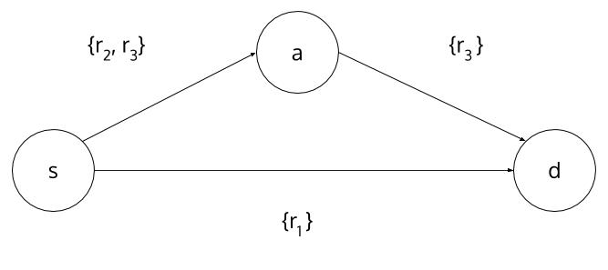

GraphToSemiring
===============

Dependencies:

1. [ocamlgraph](https://github.com/backtracking/ocamlgraph)
2. [Semiring](https://github.com/kalasoo/Semiring)


### How to use the code?

#### Files

1. Semirings
  * `semiring.ml` defines the interface of a semiring and a matrix semiring.
  * `minplus.ml` defines MinPlus Semiring.
  * `martelli.ml` defines Martelli Semiring.
  * `boolean.ml` defines Boolean Semiring.
2. `graphloader.ml` loads `.gml` file to a graph.
3. `semiringloader.ml` loads converts a graph to a matrix semiring.
3. `graphs/` folder contains sample .gml files.

#### Compilation

```shell

corebuild -pkg ocamlgraph -pkg str load.byte

```

#### Command

```shell
$ ./load.byte --help

usage: ./load <options>
  -g  <String>  path to gml file
  -help  Display this list of options
  --help  Display this list of options
```

### Example

#### .gml file and resource file

.gml graph file:
```
graph [
  node [
    id 0
    label "node 0"
  ]
  node [
    id 1
    label "node 1"
  ]
  node [
    id 2
    label "node 2"
  ]
  node [
    id 3
    label "node 3"
  ]
  edge [
    source 0
    target 1
    label "((r1))"
  ]
  edge [
    source 0
    target 2
    label "((r2 r3))"
  ]
  edge [
    source 1
    target 3
    label "((r2) (r3))"
  ]
  edge [
    source 2
    target 3
    label "((r1 r2) (r3 r4))"
  ]
]
```

Corresponding graph:


#### Command
```
$ ./load -g graphs/test.gml -r -f graphs/test_resource 
load graph and resources
0:  2 3
1:  1
2:  3

generate mms
cutset
loop 0
loop 1
loop 2

row 0, col 0
{
}

row 0, col 1
{
  { 2 }
  { 3 }
}

row 0, col 2
{
  { 2 1 }
  { 3 1 }
}

row 1, col 0
{
  { }
}

row 1, col 1
{
}

row 1, col 2
{
  { 3 }
}

row 2, col 0
{
  { }
}

row 2, col 1
{
  { }
}

row 2, col 2
{
}
```

#### What does output mean?

1. `load graph and resources`: read and interpret .gml and resource files.
2. `generate mms`: generates Generalized Matrix Martelli Semiring.
3. `cutset`: enumerates all minimal cutsets.

```
row 0, col 2
{
  { 2 1 }
  { 3 1 }
}

==> for source vertex 0 to destination vertex 2, there are two minimal cutsets.
==> 1. {resource 1, resource 2} 2. {resource 1, resource 3}
```

