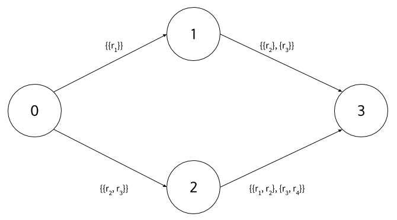

GraphToSemiring
===============

Dependencies:

1. [ocamlgraph](https://github.com/backtracking/ocamlgraph)
2. [Semiring](https://github.com/kalasoo/Semiring)


### How to use the code?

#### Files

1. `semiring.ml` defines the interface of a semiring and a matrix semiring and provides several sample semirings.
  * `MPS`: MinPlus Semiring.
  * `MS`: defines Martelli Semiring.
  * `BS`: defines Boolean Semiring.
2. `graphloader.ml` loads `.gml` file to a graph.
3. `graphs/` folder contains sample .gml files.

#### Compilation

```shell

corebuild -pkg ocamlgraph -pkg str load.byte

```

#### Command

```shell
$ ./load.byte --help

usage: ./load.byte <options>
  -g  <String> path to gml file
  -help  Display this list of options
  --help  Display this list of options
```

### Example

#### .gml file and resource file

.gml graph file:
```gml
graph [
  node [
    id 0
    label "node 0"
  ]
  node [
    id 1
    label "node 1"
  ]
  node [
    id 2
    label "node 2"
  ]
  node [
    id 3
    label "node 3"
  ]
  edge [
    source 0
    target 1
    label "((r1))"
  ]
  edge [
    source 0
    target 2
    label "((r2 r3))"
  ]
  edge [
    source 1
    target 3
    label "((r2) (r3))"
  ]
  edge [
    source 2
    target 3
    label "((r1 r2) (r3 r4))"
  ]
]
```

Corresponding graph:


#### Command
```
$ ./load.byte

>>> Load graph
nodes:
  0
  1
  2
  3
edges:
  [0 1]: ((r1))
  [0 2]: ((r2 r3))
  [1 3]: ((r2) (r3))
  [2 3]: ((r1 r2) (r3 r4))

>>> Make Martelli Semiring

>>> Solve Semiring
| ()   ; ((r1)) ; ((r2 r3)) ; ((r1 r2)(r2 r3)(r3 r4)) |
| (()) ; ()     ; (())      ; ((r2)(r3))              |
| (()) ; (())   ; ()        ; ((r1 r2)(r3 r4))        |
| (()) ; (())   ; (())      ; ()                      |
```

#### What does output mean?

1. `Load graph`: read and interpret a .gml files (resources are assigned on labels of edges).
2. `Make Martelli Semiring`: generate a martelli semiring.
3. `Solve Semiring`: the graph is solved with the martelli semiring.

